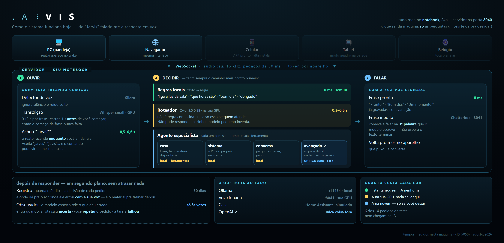

# JARVIS

Assistente pessoal de voz estilo Homem de Ferro, com a voz que você escolheu.
Fale **"Jarvis, liga a luz da sala"** — tudo numa frase só — e a casa obedece.
Tudo é processado no seu notebook, sem mandar áudio pra internet.

Também funciona em duas etapas: diga só **"Jarvis"**, ele responde "Sim?" e aí você
manda o comando. No celular e no relógio dá pra tocar no reator em vez de chamar.

## Como ligar

O servidor liga sozinho com o Windows (tarefa "JARVIS Server"). Pra ligar na mão:

```
server\start_jarvis.bat
```

Depois abra `http://SEU-IP:8040` em qualquer navegador da casa — essa é a tela do PC.

## Instalar nos aparelhos

| Aparelho | Arquivo | Como |
|---|---|---|
| Tablet / Celular | `releases\Jarvis.apk` | Copie pro aparelho e instale. Na primeira tela, informe o IP do notebook (ex.: `192.168.0.10:8040`), o device id (`tablet-sala` ou `celular-matheus`) e o token que está em `config\devices.yml`. |
| Galaxy Watch | `releases\Jarvis-Watch.apk` | Instale via ADB por Wi-Fi no relógio. Device id `galaxy-watch`. |
| PC (este notebook) | `releases\JARVIS-Desktop-Setup.exe` | Instala o JARVIS de bandeja: fica só um ícone oculto perto do relógio, ouvindo. Diga "Jarvis" e a janela com o reator aparece; ao terminar, ela some sozinha. Arraste a janela pra onde quiser (ela lembra o lugar) e use o **X** pra recolher pra bandeja. Inicia com o Windows. |

No tablet, deixe o app aberto no suporte: a tela fica preta com relógio, temperatura e o
reator respirando. É só falar "Jarvis".

## O que dá pra pedir hoje

- "liga / desliga a luz" (da sala, do quarto, do escritório — ou do cômodo onde você está)
- "que horas são?"
- "qual a temperatura?"
- "bom dia", "obrigado" — ele responde na hora, sem pensar
- Qualquer outra pergunta vai pra IA e volta falada.

As três primeiras e os cumprimentos são resolvidos por regra, sem IA nenhuma — por isso
saem instantâneos. O resto passa por um modelo pequeno que decide qual "especialista"
cuida do pedido (casa, computador, conversa, ou os difíceis na nuvem).

No celular e no relógio também dá pra **tocar no reator** pra falar sem chamar pelo nome.

## A voz

A voz do JARVIS é clonada da amostra em `server/data/voice/jarvis_ref.wav`, gerada na sua
GPU. Pra trocar por outra amostra, veja [docs/VOZ.md](docs/VOZ.md).

## Configurar a casa de verdade

Por enquanto as luzes rodam em modo simulado. Pra conectar no Home Assistant real,
edite `config\settings.yml` (`home_assistant: mode: real` + url) e coloque o token em
`config\.env` (`HA_TOKEN=...`). Os cômodos e lâmpadas ficam em `config\house.yml`.

## Documentação técnica

Um desenho de como tudo se encaixa, com os tempos medidos:



O resto está em [`docs/`](docs/): arquitetura, APIs, como adicionar skills, dispositivos,
trocar STT/TTS/LLM e a memória do projeto. Os agentes, o registro das interações e o
observador estão em [docs/AGENTES.md](docs/AGENTES.md).
